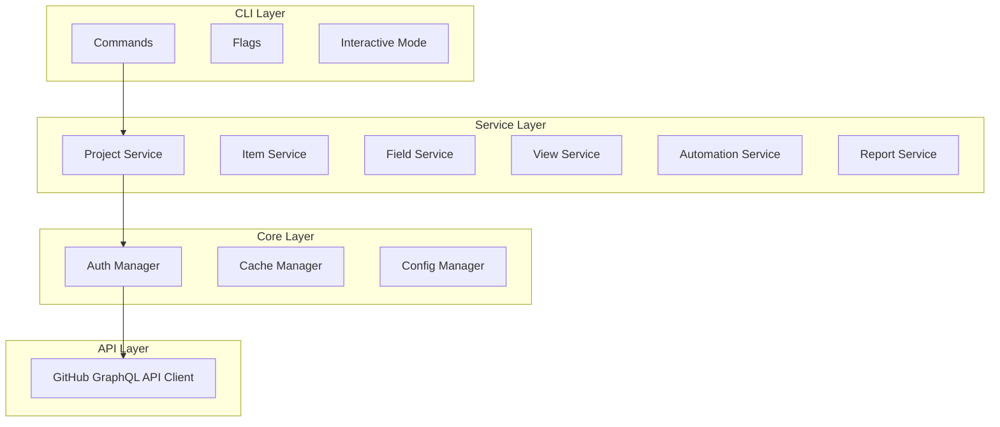

# ghp-cli

[](https://github.com/roboco-io/ghp-cli/actions)
[](https://goreportcard.com/report/github.com/roboco-io/ghp-cli)
[](https://codecov.io/gh/roboco-io/ghp-cli)
[](https://opensource.org/licenses/MIT)

> 🚧 **Work in Progress** - This tool is under active development. See [Issues](https://github.com/roboco-io/ghp-cli/issues) for current status and roadmap.

**ghp-cli** is a powerful command-line interface for managing GitHub Projects v2. It provides complete control over GitHub Projects features that are missing or limited in the official `gh` CLI.

## Why ghp-cli?

The official GitHub CLI (`gh`) has limited support for GitHub Projects v2. Our analysis shows that **81% of GitHub Projects features are missing** from `gh`, including:

- ❌ **View Management** - No support for table, board, or roadmap views
- ❌ **Automation Workflows** - No automation or workflow management
- ❌ **Bulk Operations** - No batch processing capabilities  
- ❌ **Advanced Filtering** - Limited search and filtering options
- ❌ **Reporting & Analytics** - No charts, statistics, or reports

**ghp-cli fills these gaps** with comprehensive GitHub Projects support.

## Features

### ✅ Current Features (MVP)
- **Project Management**: Create, list, view, edit, delete, and copy projects
- **Basic CLI Structure**: Full cobra-based command structure with configuration
- **GitHub CLI Integration**: Reuses existing gh CLI authentication seamlessly
- **Testing & CI/CD**: 100% test coverage with automated testing pipeline
- **Cross-platform**: Support for macOS, Linux, and Windows

### 🚧 In Development (See [Issues](https://github.com/roboco-io/ghp-cli/issues))

#### Phase 1: Core (MVP) - Q1 2024
- [ ] GitHub CLI authentication integration
- [ ] GraphQL client for GitHub Projects API v2  
- [ ] Project management commands
- [ ] Item management (issues, PRs, drafts)
- [ ] Field management (text, number, date, select, iteration)

#### Phase 2: Advanced Features - Q2 2024
- [ ] View management (table, board, roadmap)
- [ ] Bulk operations (import/export CSV, JSON, Excel)
- [ ] Interactive TUI mode with Bubble Tea
- [ ] Advanced filtering and sorting

#### Phase 3: Automation & Analytics - Q3 2024
- [ ] Automation workflows
- [ ] Reporting and analytics
- [ ] Burndown and velocity charts
- [ ] Custom report templates

#### Phase 4: Enterprise Features - Q4 2024
- [ ] Cross-repository projects
- [ ] 50,000+ item support
- [ ] Backup and restore
- [ ] Migration from Jira/Trello/Asana
- [ ] Team collaboration features

## Installation

### Homebrew (macOS/Linux)
```bash
brew install ghp-cli
```

### Go Install
```bash
go install github.com/roboco-io/ghp-cli@latest
```

### Download Binary
```bash
curl -L https://github.com/roboco-io/ghp-cli/releases/latest/download/ghp-$(uname -s)-$(uname -m) -o ghp
chmod +x ghp
mv ghp /usr/local/bin/
```

### Docker
```bash
docker run --rm ghcr.io/roboco-io/ghp-cli:latest --help
```

## Quick Start

```bash
# Authentication - uses existing gh CLI tokens
gh auth login  # First, authenticate with GitHub CLI
ghp auth status  # Check authentication status (coming soon)

# Or use environment variables as fallback
export GITHUB_TOKEN="your-github-token"

# List projects
ghp list --org myorg
ghp list --user myuser

# Create a project
ghp create "My Project" --org myorg --description "Project description"

# View project details
ghp view PROJECT_ID

# Add items to project
ghp item add PROJECT_ID --issue owner/repo#42
ghp item add PROJECT_ID --pr owner/repo#43
ghp item add PROJECT_ID --draft "Task title" --body "Task description"

# Manage fields
ghp field create PROJECT_ID "Priority" --type single_select --options "High,Medium,Low"
ghp field list PROJECT_ID

# Bulk operations (coming soon)
ghp bulk import PROJECT_ID --file data.csv
ghp bulk export PROJECT_ID --format json --output project-data.json

# Generate reports (coming soon)
ghp report burndown PROJECT_ID --sprint current
ghp stats PROJECT_ID --period 30d
```

## Configuration

Create a config file at `~/.ghp.yaml`:

```yaml
# GitHub authentication
token: "your-github-token"
org: "default-org"

# Output preferences
format: "table"  # table, json, yaml
no-cache: false
debug: false

# Default limits
limit: 50
```

Environment variables:
- `GHP_TOKEN` or `GITHUB_TOKEN` - GitHub Personal Access Token
- `GHP_ORG` - Default organization
- `GHP_FORMAT` - Default output format (table, json, yaml)
- `GHP_DEBUG` - Enable debug output

## Examples

See [docs/examples.md](docs/examples.md) for comprehensive usage examples.

## Architecture



## Development

### Prerequisites
- Go 1.21+
- Git
- Make

### Setup
```bash
git clone https://github.com/roboco-io/ghp-cli.git
cd ghp-cli
make setup
```

### Testing
```bash
make test           # Run all tests
make test-unit      # Unit tests only
make coverage       # Generate coverage report
make lint           # Run linter
```

### Building
```bash
make build          # Build binary
make install        # Install to GOPATH/bin
```

### Contributing

We welcome contributions! Please see:
- [Contributing Guide](CONTRIBUTING.md)
- [Development Setup](docs/DEVELOPMENT.md)
- [Architecture Overview](docs/ARCHITECTURE.md)
- [Open Issues](https://github.com/roboco-io/ghp-cli/issues)

## Roadmap

See our [detailed roadmap](docs/PRD.md#14-타임라인) and [feature comparison](docs/feature-comparison.md).

## Support

- 📖 [Documentation](docs/)
- 🐛 [Bug Reports](https://github.com/roboco-io/ghp-cli/issues/new?template=bug_report.md)
- 💡 [Feature Requests](https://github.com/roboco-io/ghp-cli/issues/new?template=feature_request.md)
- 💬 [Discussions](https://github.com/roboco-io/ghp-cli/discussions)

## License

[MIT License](LICENSE) - see the [LICENSE](LICENSE) file for details.

## Acknowledgments

- GitHub team for the Projects v2 API
- [Charm](https://charm.sh/) for excellent TUI libraries
- [spf13/cobra](https://github.com/spf13/cobra) for CLI framework
- All contributors and early adopters

---

**Star ⭐ this repo if you find it useful!**