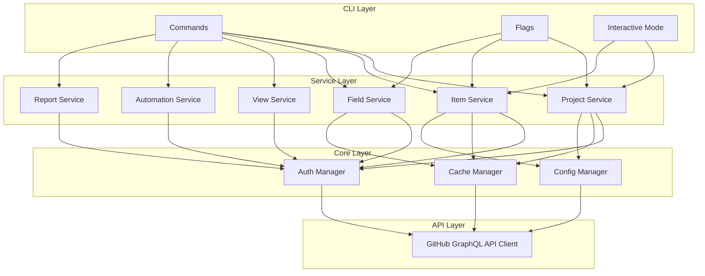
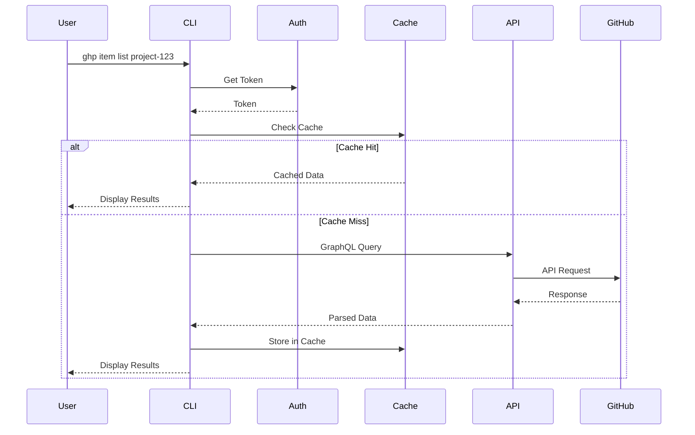
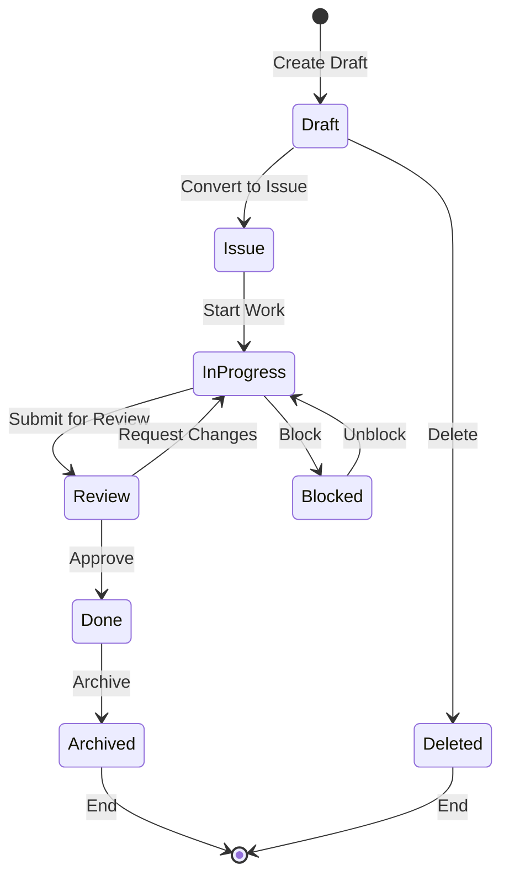
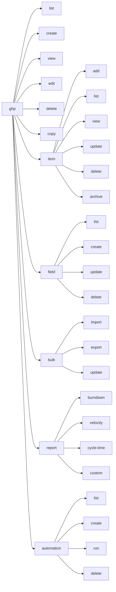
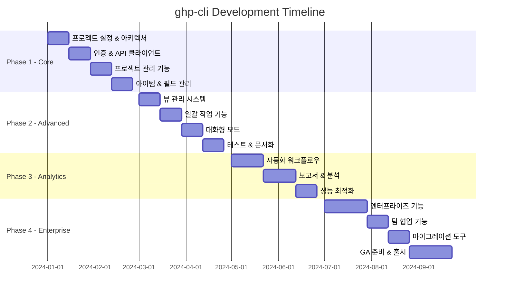

# Product Requirements Document (PRD): ghp-cli

## 1. 제품 개요

### 1.1 제품 정보
- **제품명**: ghp-cli
- **버전**: 1.0.0
- **플랫폼**: macOS, Linux, Windows
- **구현 언어**: Go 1.21+
- **라이선스**: MIT

### 1.2 제품 비전
GitHub Projects를 커맨드라인에서 완벽하게 제어할 수 있는 강력하고 직관적인 CLI 도구를 제공하여, 개발자가 터미널을 떠나지 않고도 프로젝트 관리를 효율적으로 수행할 수 있게 한다.

### 1.3 핵심 가치
- **생산성**: 반복 작업 자동화 및 일괄 처리로 작업 시간 80% 단축
- **접근성**: 터미널 환경에서 모든 GitHub Projects 기능 접근
- **확장성**: 스크립팅 및 CI/CD 파이프라인 통합 지원
- **신뢰성**: 안정적인 API 호출 및 에러 처리

## 2. 기술 사양

### 2.1 아키텍처



### 2.2 기술 스택

#### 핵심 의존성
```go
module github.com/roboco-io/gh-project-cli

go 1.21

require (
    github.com/spf13/cobra v1.9.1          // CLI 프레임워크
    github.com/spf13/viper v1.20.1         // 설정 관리
    github.com/shurcooL/graphql v0.0.0     // GraphQL 클라이언트
    github.com/charmbracelet/bubbles v0.17.0 // TUI 컴포넌트
    github.com/charmbracelet/bubbletea v1.3.6 // 대화형 UI
    github.com/charmbracelet/lipgloss v0.9.0  // 스타일링
    github.com/olekukonko/tablewriter v0.0.5  // 테이블 출력
    github.com/fatih/color v1.16.0         // 컬러 출력
    github.com/briandowns/spinner v1.23.0  // 로딩 인디케이터
    github.com/AlecAivazis/survey/v2 v2.3.7 // 대화형 프롬프트
    github.com/cli/go-gh v1.2.1            // GitHub CLI 통합
    github.com/patrickmn/go-cache v2.1.0   // 인메모리 캐시
    github.com/stretchr/testify v1.10.0    // 테스트
    gopkg.in/yaml.v3 v3.0.1               // YAML 처리
)
```

### 2.3 데이터 플로우



### 2.4 아이템 상태 플로우



### 2.5 프로젝트 구조

```
ghp-cli/
├── cmd/
│   ├── ghp/                 # 메인 엔트리 포인트
│   │   └── main.go
│   ├── root.go              # 루트 명령어
│   ├── project.go           # 프로젝트 명령어
│   ├── item.go              # 아이템 명령어
│   ├── field.go             # 필드 명령어
│   ├── view.go              # 뷰 명령어
│   ├── automation.go        # 자동화 명령어
│   └── report.go            # 보고서 명령어
├── internal/
│   ├── api/                 # API 클라이언트
│   │   ├── client.go
│   │   ├── graphql/         # GraphQL 쿼리/뮤테이션
│   │   └── rest/            # REST API (필요시)
│   ├── service/             # 비즈니스 로직
│   │   ├── project/
│   │   ├── item/
│   │   ├── field/
│   │   ├── view/
│   │   ├── automation/
│   │   └── report/
│   ├── auth/                # 인증 관리
│   │   ├── token.go
│   │   └── oauth.go
│   ├── cache/               # 캐싱 레이어
│   │   └── cache.go
│   ├── config/              # 설정 관리
│   │   └── config.go
│   ├── ui/                  # UI 컴포넌트
│   │   ├── interactive/     # 대화형 UI
│   │   ├── table/           # 테이블 출력
│   │   └── progress/        # 진행 표시
│   └── utils/               # 유틸리티
│       ├── format/          # 출력 포맷터
│       ├── validator/       # 입력 검증
│       └── error/           # 에러 처리
├── pkg/                     # 외부 패키지
│   └── models/              # 데이터 모델
├── scripts/                 # 빌드/배포 스크립트
├── test/                    # 통합 테스트
├── docs/                    # 문서
├── .github/                 # GitHub Actions
├── go.mod
├── go.sum
├── Makefile
└── README.md
```

## 3. 기능 명세

### 3.0 명령어 구조



### 3.1 Phase 1: Core (MVP) - 2개월

#### 3.1.1 프로젝트 관리
```bash
# 프로젝트 목록 조회
ghp list [--org <org>] [--user <user>] [--limit <n>] [--format json|table]

# 프로젝트 생성
ghp create <name> [--org <org>] [--description <desc>] [--template <id>]

# 프로젝트 상세 조회
ghp view <project-id> [--format json|table|yaml]

# 프로젝트 수정
ghp edit <project-id> [--title <title>] [--description <desc>]

# 프로젝트 삭제
ghp delete <project-id> [--force]

# 프로젝트 복사
ghp copy <project-id> <new-name> [--org <org>]
```

#### 3.1.2 아이템 관리
```bash
# 아이템 추가
ghp item add <project-id> --issue <owner/repo#number>
ghp item add <project-id> --pr <owner/repo#number>
ghp item add <project-id> --draft <title> [--body <body>]

# 아이템 목록 조회
ghp item list <project-id> [--filter <expression>] [--limit <n>]

# 아이템 상세 조회
ghp item view <project-id> <item-id>

# 아이템 업데이트
ghp item update <project-id> <item-id> --field <name>=<value>

# 아이템 삭제
ghp item delete <project-id> <item-id> [--force]

# 아이템 아카이브
ghp item archive <project-id> <item-id>
```

#### 3.1.3 필드 관리
```bash
# 필드 목록 조회
ghp field list <project-id>

# 필드 생성
ghp field create <project-id> <name> --type text|number|date|single_select|iteration

# 필드 수정
ghp field update <project-id> <field-id> [--name <name>] [--options <json>]

# 필드 삭제
ghp field delete <project-id> <field-id> [--force]
```

### 3.2 Phase 2: Advanced - 2개월

#### 3.2.1 뷰 관리
```bash
# 뷰 목록 조회
ghp view list <project-id>

# 뷰 생성
ghp view create <project-id> <name> --layout table|board|roadmap

# 뷰 설정
ghp view config <project-id> <view-id> \
    [--filter <expression>] \
    [--sort <field>:<direction>] \
    [--group-by <field>]

# 뷰 삭제
ghp view delete <project-id> <view-id>
```

#### 3.2.2 일괄 작업
```bash
# CSV 파일로 일괄 가져오기
ghp bulk import <project-id> --file <csv-file> [--mapping <json>]

# 일괄 업데이트
ghp bulk update <project-id> --file <csv-file>

# 일괄 내보내기
ghp bulk export <project-id> --format csv|json|excel --output <file>

# 조건부 일괄 작업
ghp bulk update <project-id> --filter <expression> --set <field>=<value>
```

#### 3.2.3 대화형 모드
```bash
# 대화형 프로젝트 선택
ghp interactive

# 대화형 아이템 추가
ghp item add --interactive

# 대화형 필드 업데이트
ghp item update --interactive
```

### 3.3 Phase 3: Automation & Analytics - 2개월

#### 3.3.1 자동화
```bash
# 워크플로우 목록
ghp automation list <project-id>

# 워크플로우 생성
ghp automation create <project-id> <name> --trigger <event> --action <action>

# 워크플로우 실행
ghp automation run <project-id> <workflow-id>

# 워크플로우 삭제
ghp automation delete <project-id> <workflow-id>

# 조건부 자동화
ghp automation create <project-id> "Auto Archive" \
    --trigger "item.status=Done" \
    --action "archive"
```

#### 3.3.2 보고서 및 분석
```bash
# 프로젝트 통계
ghp stats <project-id> [--period 7d|30d|90d]

# 번다운 차트
ghp report burndown <project-id> --sprint <iteration-field>

# 속도 차트
ghp report velocity <project-id> --sprints <n>

# 사이클 타임
ghp report cycle-time <project-id> [--from <date>] [--to <date>]

# 커스텀 보고서
ghp report custom <project-id> --template <template-file> --output <file>
```

### 3.4 Phase 4: Enterprise - 3개월

#### 3.4.1 고급 기능
```bash
# 크로스 레포지토리 프로젝트
ghp cross-repo add <project-id> --repos <repo1,repo2,repo3>

# 대규모 프로젝트 지원 (50,000+ 아이템)
ghp config set max-items 50000

# 프로젝트 백업
ghp backup <project-id> --output <file>

# 프로젝트 복원
ghp restore --file <backup-file>

# 마이그레이션
ghp migrate --from jira|trello|asana --config <config-file>
```

#### 3.4.2 팀 협업
```bash
# 권한 관리
ghp permission grant <project-id> --user <username> --role admin|write|read

# 팀 할당
ghp team assign <project-id> --team <team-slug>

# 활동 로그
ghp activity <project-id> [--user <username>] [--since <date>]
```

## 4. 사용자 인터페이스

### 4.1 출력 형식

#### 테이블 출력 (기본)
```
┌────────┬──────────────┬─────────┬──────────┬───────────┐
│ ID     │ Title        │ Status  │ Assignee │ Updated   │
├────────┼──────────────┼─────────┼──────────┼───────────┤
│ PVTI_1 │ Setup CI/CD  │ In Prog │ @john    │ 2h ago    │
│ PVTI_2 │ Add tests    │ Todo    │ @jane    │ 1d ago    │
│ PVTI_3 │ Fix bug #123 │ Done    │ @bob     │ 3d ago    │
└────────┴──────────────┴─────────┴──────────┴───────────┘
```

#### JSON 출력
```json
{
  "items": [
    {
      "id": "PVTI_1",
      "title": "Setup CI/CD",
      "status": "In Progress",
      "assignee": "@john",
      "updated": "2024-01-20T10:30:00Z"
    }
  ]
}
```

### 4.2 대화형 인터페이스

```
? Select a project: 
  ❯ roboco-io/ghp-cli (12 items)
    roboco-io/website (8 items)
    roboco-io/api (24 items)
    
? What would you like to do?
  ❯ View items
    Add item
    Update field
    Generate report
    
? Select items to update: (Space to select, Enter to confirm)
  ◯ PVTI_1: Setup CI/CD
  ◉ PVTI_2: Add tests
  ◯ PVTI_3: Fix bug #123
```

### 4.3 진행 상황 표시

```
Adding items to project...
[████████████████████░░░░░░░] 67% | 67/100 items | ETA: 5s
```

## 5. 성능 요구사항

### 5.1 응답 시간
- 단일 아이템 조회: < 500ms
- 목록 조회 (100개): < 2s
- 일괄 작업 (1000개): < 30s
- 보고서 생성: < 5s

### 5.2 동시성
- 최대 10개 동시 API 요청
- Rate limiting 자동 처리
- 지수 백오프 재시도

### 5.3 캐싱
- 프로젝트 메타데이터: 5분
- 필드 정의: 10분
- 아이템 목록: 1분
- 사용자 정보: 30분

## 6. 보안 요구사항

### 6.1 인증
- **Primary**: GitHub CLI 토큰 재사용 (gh auth login)
- **Fallback**: 환경 변수 (GITHUB_TOKEN, GH_TOKEN)
- GitHub CLI의 키체인/credential store 활용
- 기존 gh CLI 인증 상태 자동 감지

### 6.2 권한
- 최소 권한 원칙
- 필요 스코프 자동 검증
- 권한 부족 시 명확한 안내

### 6.3 데이터 보호
- 로컬 캐시 암호화
- 민감 정보 마스킹
- 감사 로그 생성

## 7. 에러 처리

### 7.1 에러 코드 체계

| 코드 | 카테고리 | 설명 |
|------|---------|------|
| E1xxx | 인증 | 인증 관련 오류 |
| E2xxx | API | API 호출 오류 |
| E3xxx | 검증 | 입력 검증 오류 |
| E4xxx | 권한 | 권한 부족 |
| E5xxx | 네트워크 | 네트워크 오류 |

### 7.2 에러 메시지 예시

```
Error [E2001]: Failed to fetch project
  
  The project 'PVT_123' could not be found.
  
  Possible causes:
  • The project ID is incorrect
  • You don't have access to this project
  • The project has been deleted
  
  Try:
  • Run 'ghp list' to see available projects
  • Check your permissions with 'ghp permission check'
```

## 8. 테스트 전략

### 8.1 테스트 범위
- 단위 테스트: 80% 이상 커버리지
- 통합 테스트: 핵심 워크플로우
- E2E 테스트: 주요 사용 시나리오
- 성능 테스트: 대용량 데이터 처리

### 8.2 테스트 자동화
```yaml
# .github/workflows/test.yml
name: Test
on: [push, pull_request]
jobs:
  test:
    runs-on: ubuntu-latest
    steps:
      - uses: actions/checkout@v3
      - uses: actions/setup-go@v4
        with:
          go-version: '1.21'
      - run: make test
      - run: make coverage
```

## 9. 배포 전략

### 9.1 릴리스 채널
- **Stable**: 안정 버전 (월 1회)
- **Beta**: 베타 버전 (주 1회)
- **Nightly**: 나이틀리 빌드 (매일)

### 9.2 배포 방법
```bash
# Homebrew
brew install ghp-cli
brew upgrade ghp-cli

# Go Install
go install github.com/roboco-io/gh-project-cli@latest

# Binary Download
curl -L https://github.com/roboco-io/gh-project-cli/releases/latest/download/ghp-$(uname -s)-$(uname -m) -o ghp
chmod +x ghp
```

### 9.3 버전 관리
- Semantic Versioning (SemVer)
- 자동 변경 로그 생성
- 하위 호환성 보장

## 10. 모니터링 및 분석

### 10.1 사용량 메트릭
- 일일 활성 사용자 (DAU)
- 명령어별 사용 빈도
- 에러 발생률
- 평균 응답 시간

### 10.2 품질 메트릭
- 버그 리포트 수
- 해결 시간
- 사용자 만족도 (NPS)
- 커뮤니티 기여도

## 11. 문서화

### 11.1 사용자 문서
- README.md: 빠른 시작 가이드
- USAGE.md: 상세 사용법
- EXAMPLES.md: 실제 사용 예제
- FAQ.md: 자주 묻는 질문

### 11.2 개발자 문서
- CONTRIBUTING.md: 기여 가이드
- ARCHITECTURE.md: 아키텍처 설명
- API.md: API 레퍼런스
- DEVELOPMENT.md: 개발 환경 설정

## 12. 성공 지표 (KPI)

### 12.1 출시 후 3개월
- 월간 활성 사용자: 500명
- GitHub 스타: 1,000개
- 버그 해결률: 90%
- 평균 응답 시간: < 2초

### 12.2 출시 후 6개월
- 월간 활성 사용자: 2,000명
- GitHub 스타: 3,000개
- 기업 사용자: 10개
- 커뮤니티 기여자: 20명

### 12.3 출시 후 1년
- 월간 활성 사용자: 10,000명
- GitHub 스타: 10,000개
- 기업 사용자: 50개
- 에코시스템 통합: 10개 (CI/CD, IDE 등)

## 13. 리스크 및 완화 방안

### 13.1 기술적 리스크

| 리스크 | 영향도 | 가능성 | 완화 방안 |
|--------|--------|--------|-----------|
| GitHub API 변경 | 높음 | 중간 | API 버전 관리, 추상화 레이어 |
| Rate Limiting | 중간 | 높음 | 캐싱, 배치 처리, 백오프 |
| 대용량 데이터 처리 | 높음 | 중간 | 페이지네이션, 스트리밍 |
| 토큰 보안 | 높음 | 낮음 | 키체인 사용, 암호화 |

### 13.2 사업적 리스크

| 리스크 | 영향도 | 가능성 | 완화 방안 |
|--------|--------|--------|-----------|
| 사용자 채택 부진 | 높음 | 중간 | 마케팅, 커뮤니티 구축 |
| 경쟁 도구 출현 | 중간 | 높음 | 차별화 기능, 빠른 혁신 |
| 유지보수 부담 | 중간 | 중간 | 자동화, 커뮤니티 기여 |

## 14. 타임라인



## 15. 부록

### 15.1 용어집
- **Project**: GitHub Projects v2 프로젝트
- **Item**: 프로젝트 내 작업 항목 (이슈, PR, 드래프트)
- **Field**: 아이템의 메타데이터 필드
- **View**: 프로젝트 데이터의 시각화 방식
- **Iteration**: 스프린트 또는 작업 주기

### 15.2 참고 자료
- [GitHub Projects API Documentation](https://docs.github.com/graphql/reference/objects#projectv2)
- [GitHub CLI Architecture](https://github.com/cli/cli/blob/trunk/docs/architecture.md)
- [GraphQL Best Practices](https://graphql.org/learn/best-practices/)
- [Go CLI Guidelines](https://go.dev/doc/effective_go)

### 15.3 연락처
- **제품 책임자**: product@roboco.io
- **기술 지원**: support@roboco.io
- **커뮤니티**: https://github.com/roboco-io/gh-project-cli/discussions